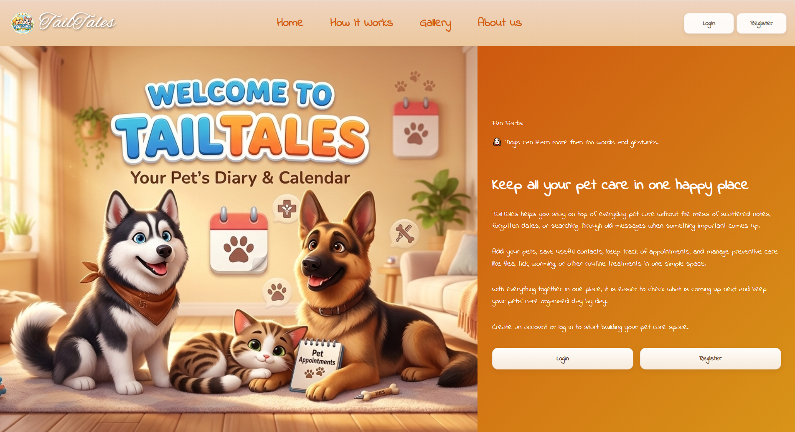
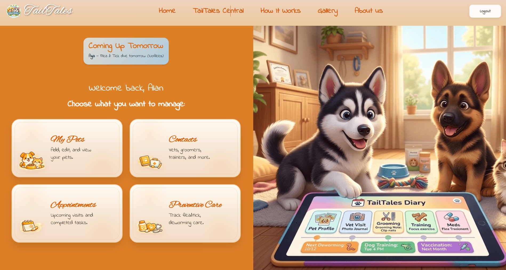
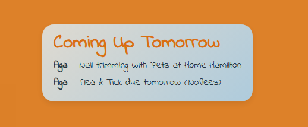
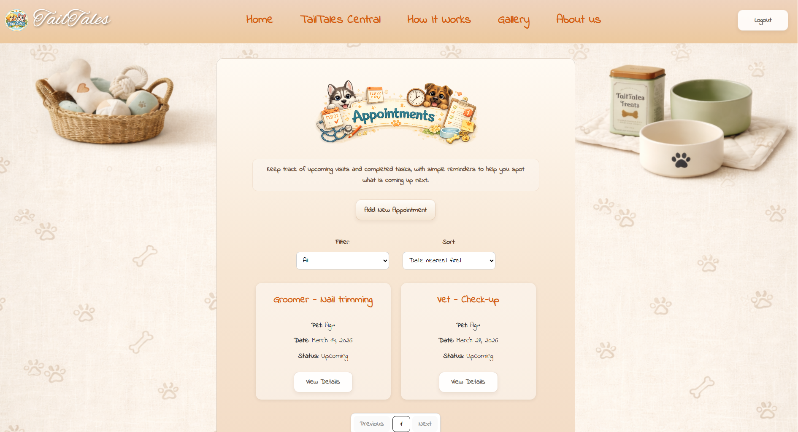
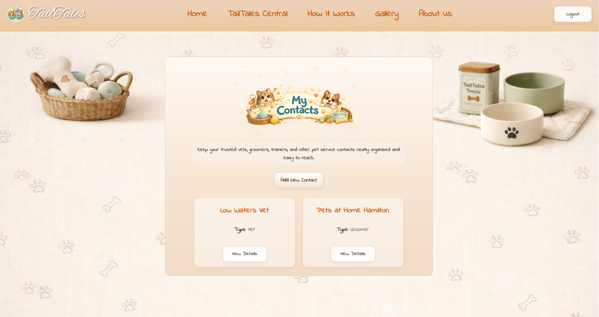
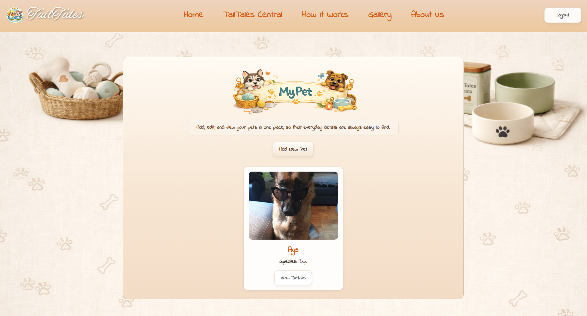

# TailTales

**Live Demo:** https://anci82.pythonanywhere.com/

TailTales is a Django web app designed to help pet owners keep important pet care information organised in one place.

Users can create pet profiles with photos, manage appointments, track preventive care such as flea, tick, worming, and vaccines, save trusted service contacts, and check reminders for upcoming care tasks.

## Features

- User registration, login, logout, and password reset
- Welcome email support with Resend and Anymail
- Pet profiles with photo upload and key pet details
- Appointment tracking with date, pet, type, status, filtering, and sorting
- Preventive care tracking with due dates and history
- Service contact management for vets, groomers, trainers, and other providers
- Dashboard with upcoming reminders
- Responsive pet-themed interface
- Django admin panel for managing application data

## Screenshots

  
*Public landing page with welcoming design and pet-themed styling.*

  
*Dashboard with quick access to key sections and upcoming reminders.*

  
*Next Day Reminders.*

  
*Appointments page with filtering, sorting, and detailed records.*

  
*Contacts page for managing trusted pet service providers.*

  
*Pet profile page with uploaded image and pet details.*

## Tech Stack

- Python
- Django
- Django REST Framework
- SQLite
- Pillow
- HTML
- CSS
- JavaScript
- Anymail
- Resend
- Python Dotenv

## Project Structure

The project is organised into reusable Django apps:

- `accounts` - authentication, user-related features, and email flows
- `pets` - pet profiles and photo uploads
- `care` - preventive care and treatment history
- `contacts` - service contacts management
- `common` - dashboard and shared views/templates

## Quick Start

```bash
git clone https://github.com/Anci82/TailTales.git
cd TailTales
python -m venv venv
source venv/bin/activate
# On Windows use: venv\Scripts\activate

pip install -r requirements.txt
python manage.py migrate
python manage.py createsuperuser
python manage.py runserver
